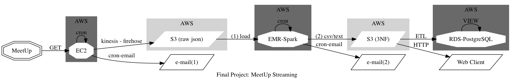

MeetUp Data Engineering Pipeline
--------------------------------

API documentation can be found here: https://www.meetup.com/meetup_api/docs/2/groups/

We don't need to install any third party (MeetUp) application.

We will use `requests.get()`

`request = requests.get("http://api.meetup.com/2/groups",params=params)`

and passing the parameters of the information we want to return. Data is received in json format.

We limit the number of requests to 200 per hours as the documentation doesn't specify a number of requests (just to avoid too many requests per hour or we will be throttled out for one hours and inserting bad data).

More details on the API and the json schema:

`Final-Project-MeetUp-API.ipynb`

`Final-Project-7-JSON-Structure.ipynb`

The characteristics of the AWS EC2 and EMR Spark instances are described here, including the AWS Kinesis Firehose:

`Final-Project-AWS-Instructions.ipynb`

a) We describe the system architecture here:

`Final-Project-1-Diagram-Overview.ipynb`

b) We describe the relational data model here:

`Final-Project-2-ER-Diagram.ipynb`

c) We have used jupyter notebooks to develop the scripts used in Spark AWS EMR to normalize the json data.

`Final-Project-3-EMR-Spark-RDD.ipynb`

`Final-Project-4-EMR-Spark-DataFrames.ipynb`

d) The details of the implementation of RDS PostgreSQL with normalized data:

`Final-Project-8-RDS-PostgreSQL.ipynb`

e) All reports generated from the pipeline can be found here:

`Final-Project-9-S3-Static-Website-Reports.ipynb`

f) All scripts can be found on the `scripts` folder.

g) All cron jobs can be found on the `cron jobs` folder.

h) All reports samples can be found on the `reports sample` folder.

i) `Airflow` has been set up on a EC2 instance and one `cron` job has been migrated as described here:

`Final-Project-10-AirFlow.ipynb`

j) `Neo4j` NoSQL GraphDB has been set up on a EC2 instance:

`Final-Project-11-Neo4j-AWS.ipynb`
